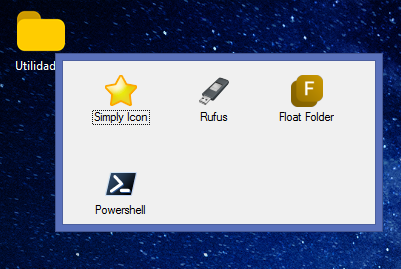

# Float Folder

Android-like folders for Windows!

---

## System Requirements

The program depends on the [.NET Framework 4.5](https://www.microsoft.com/en-us/download/details.aspx?id=30653) to work.

---

Download the **latest version** [here](https://github.com/SavanDev/FloatFolder/releases)!
